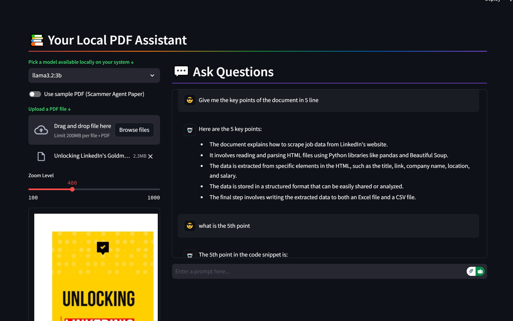

# How I Built a Local RAG App for PDF Q&A | Streamlit | LLAMA 3.x | 2025



Welcome to my project repository! In this article, I’ll walk you through how I built a **Local RAG (Retrieval-Augmented Generation) App** for **PDF Q&A** using **Streamlit** and the **LLAMA 3.x** model. This app allows users to upload a PDF, convert it into embedding vectors locally, and ask questions about the document. The local LLAMA LLM model provides accurate answers based on the PDF content.

---

## 📌 **Project Overview**

This project is a **local AI-powered PDF chatbot** that leverages the power of **RAG (Retrieval-Augmented Generation)** to answer user questions based on the content of uploaded PDFs. Here’s what makes it special:

- **Local Processing**: Everything runs on your local machine, ensuring privacy and security.
- **Streamlit GUI**: A user-friendly interface for uploading PDFs and interacting with the chatbot.
- **LLAMA 3.x Model**: A powerful local language model for generating accurate responses.
- **Embedding Vectors**: PDFs are converted into embedding vectors for efficient retrieval and analysis.

---

## 🛠️ **Technologies Used**

- **Python**: The core programming language for building the app.
- **Streamlit**: For creating the interactive web interface.
- **LLAMA 3.x**: The local language model used for generating responses.
- **LangChain**: For handling document loading, text splitting, and embeddings.
- **Chroma**: A vector database for storing and retrieving document embeddings.
- **Ollama**: For managing local LLM models and embeddings.

---

## 🚀 **How It Works**

1. **Upload a PDF**: Users can upload a PDF file through the Streamlit interface.
2. **Convert to Embeddings**: The PDF is processed and converted into embedding vectors using **OllamaEmbeddings**.
3. **Ask Questions**: Users can ask questions about the PDF content.
4. **Get Answers**: The LLAMA 3.x model retrieves relevant information from the embeddings and generates accurate answers.

---

## 📂 **Code Structure**

Here’s a breakdown of the key components of the code:

### **1. Streamlit App (`streamlit_app.py`)**
This is the main file that runs the Streamlit application. It handles:
- PDF upload and processing.
- Embedding generation using **OllamaEmbeddings**.
- Question answering using the LLAMA 3.x model.
- Chat interface for user interaction.

```python
import streamlit as st
import logging
import os
import tempfile
import shutil
import pdfplumber
import ollama
from langchain_community.document_loaders import UnstructuredPDFLoader, PyPDFLoader
from langchain_ollama import OllamaEmbeddings
from langchain_text_splitters import RecursiveCharacterTextSplitter
from langchain_community.vectorstores import Chroma
from langchain.prompts import ChatPromptTemplate, PromptTemplate
from langchain_core.output_parsers import StrOutputParser
from langchain_ollama.chat_models import ChatOllama
from langchain_core.runnables import RunnablePassthrough
from langchain.retrievers.multi_query import MultiQueryRetriever
from typing import List, Tuple, Dict, Any, Optional
